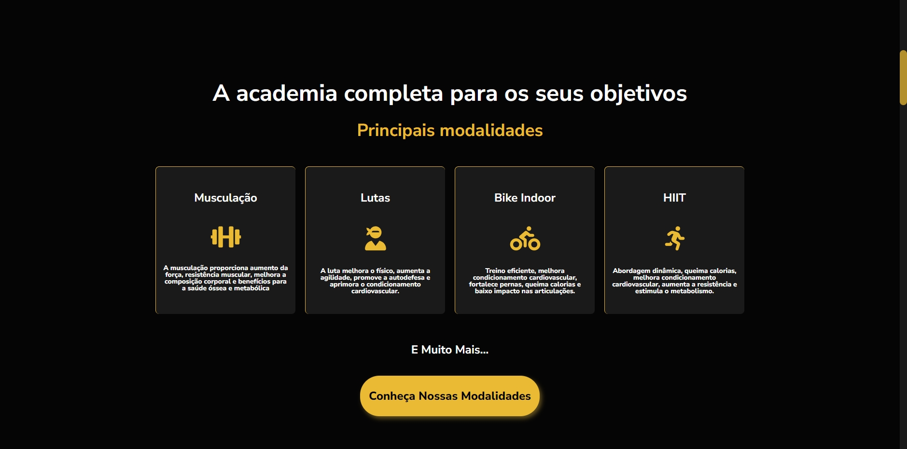
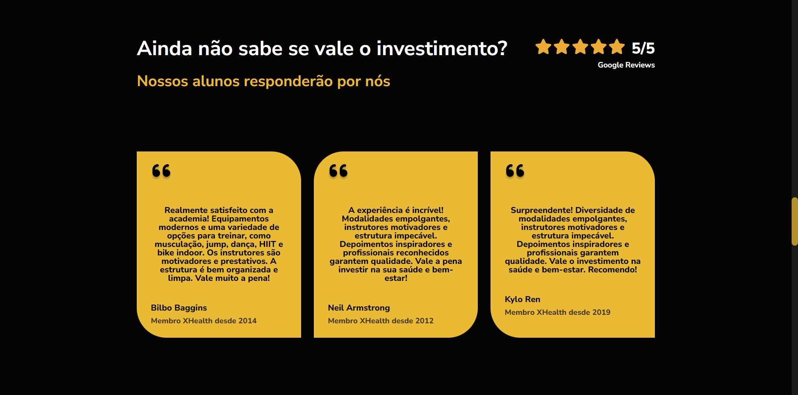
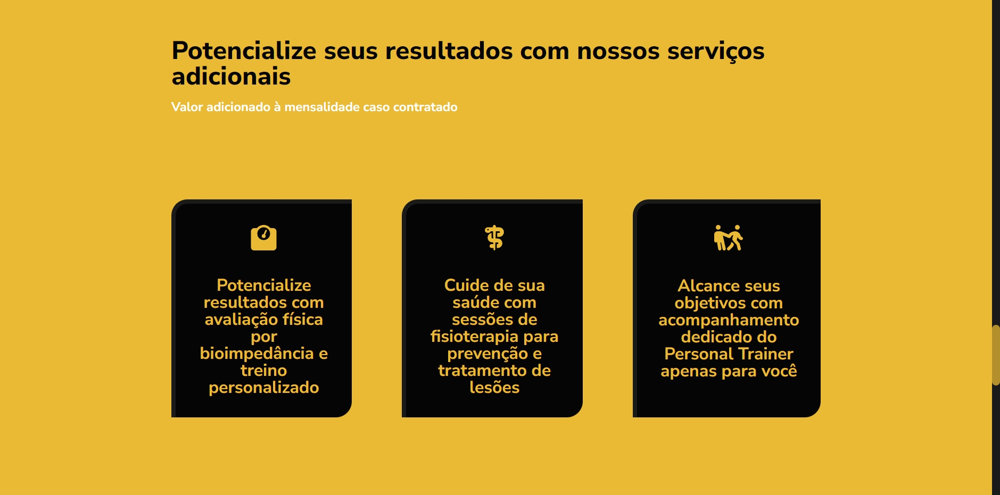
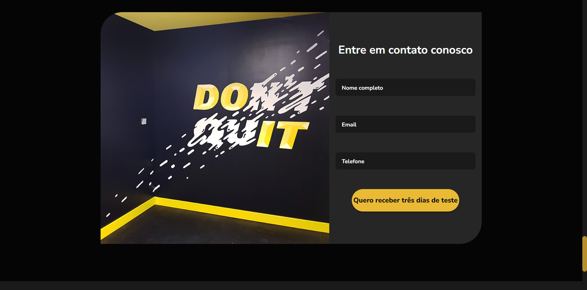
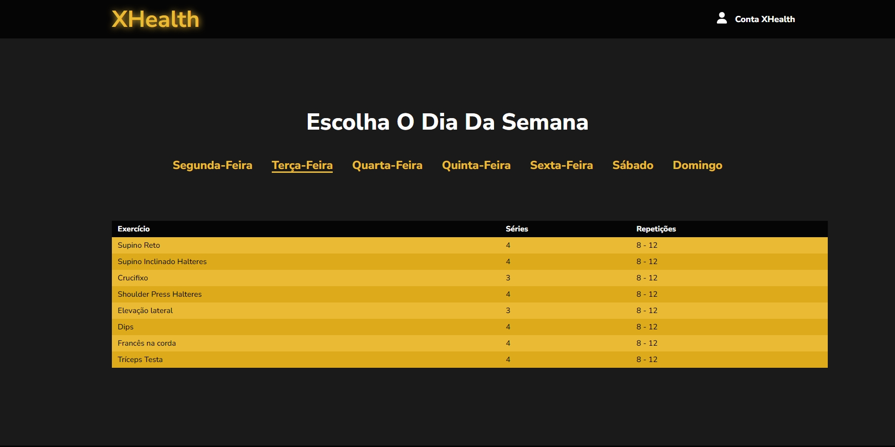

<h1>XHealth - Gym Website</h1>
a

<h2>Project Description 🏋️‍♂️</h2>

  The XHealth project is a website developed for the XHealth Gym, a space dedicated to health, well-being, and physical activities. The gym offers a variety of modalities, including weightlifting, martial arts, dance, HIIT, indoor cycling, functional training, jump, and more.

  Our goal is to create an attractive and informative page for potential clients to get a better understanding of our facilities and high-quality services. The modern and elegant design reflects the excellence of our gym, featuring state-of-the-art equipment and highly qualified instructors who are well-recognized in the market.

<h2>Technologies Used 🛠️</h2>
<ul>
  <li>
    <strong>Git:</strong> We use Git as a version control system to manage the project's source code. This allows us to work collaboratively as a team, track changes, and ensure code stability.
  </li> 
  <li>
    <strong>HTML:</strong> The HTML markup language forms the foundation of our website. It enables us to structure and organize content, providing a solid base for presenting information to users.
  </li> 
  <li>
    <strong>CSS:</strong> We utilize CSS to style the website, applying the colors, fonts, and layout that reflect the XHealth Gym's visual identity. CSS also ensures a pleasant and responsive user experience across different devices.
  </li> 
  <li>
    <strong>JavaScript:</strong> JavaScript adds interactivity and dynamism to the website. With it, we implement features like sending messages for inquiries, displaying detailed training information for students, and other functionalities that enhance the user experience.
  </li>
</ul>

<h2>Developers 👨‍💻👨‍💻</h2>
<ul>
<li><a href="#" target="_blank">Felipe Nascimento de Moura</a></li>
<li><a href="https://www.linkedin.com/in/lucasftomazela/" target="_blank" rel="noopener noreferrer">Lucas Fernando Tomazela</a></li>
</ul>

<h2>Main Features 🚀</h2>
<ul>
  <li>
    <strong>Diverse Modalities:</strong>  XHealth Gym offers a wide variety of modalities, catering to different preferences and fitness goals. From high-impact activities to gentle exercises, our gym provides options to suit everyone's needs.
  </li> 
  

    
  
 
  <li>
    <strong>Student Testimonials:</strong>  The website showcases real testimonials from our students who achieved significant results during their time at the gym. These testimonials inspire and instill confidence in potential clients, motivating them to become part of our fitness community.
  </li> 
  

    
  
 
  <li>
    <strong>Experienced Professionals:</strong>  Our instructors are highly experienced professionals and athletes who are well-respected in the fitness industry. They possess the expertise and knowledge needed to guide and support students on their fitness journeys, ensuring they reach their goals safely and effectively.
  </li> 
  

    
  
 
  <li>
    <strong>Additional Services:</strong>  In addition to the various modalities, we offer extra services such as body composition analysis with bioimpedance and personalized training plans, physiotherapy for injury treatment and prevention, and one-on-one sessions with personal trainers. These services can be availed individually to complement the students' gym experience.
  </li> 
  

    
  
 
  <li>
    <strong>Easy Communication:</strong>  Prospective clients can easily get in touch with us through the website by sending messages to inquire about our services or seek more information.
  </li> 
  

    
  
 
  <li>
    <strong>Student Area:</strong>  We have a dedicated section for enrolled students where they can access their profile information and details about their personalized training plans.
  </li> 
  

    
  
 
</ul>

<h2>Colors and Visual Identity 🎨</h2>

The XHealth Gym's visual identity is characterized by the colors #ebba34 (yellow) and #050505 (black). These colors reflect our energy, vitality, and professionalism. The website's design adheres to this color scheme, conveying a consistent and recognizable brand image of XHealth Gym.

<h2>Additional Requirement 🌟</h2>
<ul>
<li>
<strong>JS III - DOM:</strong> Felipe used the JS III - DOM module during the "Practical Project: Calc.js". He implemented the "CopyToClipBoard" functionality in the footer of the website, allowing users to easily copy important information or relevant links to the clipboard.
</li> 
<li>
<strong>Git and GitHub:</strong> Lucas utilized the Git and GitHub module, where he created the first online repository for the XHealth project. This enables the team to collaborate on the source code, track changes, and ensure project stability using the Git version control system.
</li>
</ul>

With these additional requirements and the main features mentioned above, the XHealth project is well-equipped to offer a comprehensive and attractive experience to potential gym clients, showcasing the excellence of our services and commitment to quality.

